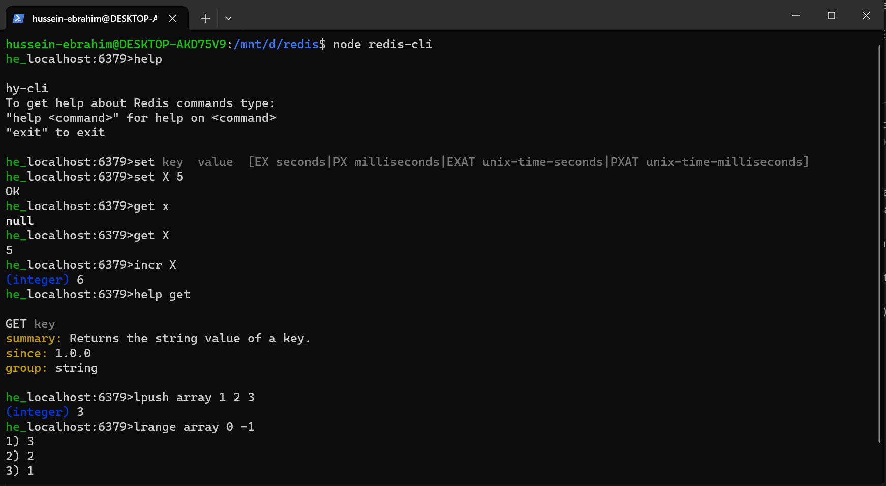

# Lite Redis Server

Lite Redis Server is a lightweight implementation of a Redis server with the features of the first redis server release.

## Table of Contents

- [Introduction](#introduction)
- [Features](#features)
- [Getting Started](#getting-started)
- [Screenshots](#screenshots)

## Introduction

Redis is in-memory storage data structure, it is widely used for it's performance. Lite redis server is an implementation of the redis server with the features of teh first release. The server receives the commands in the RESP protocol, deserializes it and take the action required, serializes the response and send it back to the client. 

he-CLI is also developed similar to the redis-cli, supporting the communication with the server, help command to the commands supported by the lite redis server and hint text completion.

The he-CLI serializes and desrializes the commands to/from RESP before sending them out to the server.

## Features

- key-value store using Map data structure on server logic
- SET key value [EX | PX | EXAT | PXAT] (sets a key to a value with expiry option if needed).
- GET key (gets the value of a specific key)
- DEL key [key ...] (removes the set of keys if exist)
- EXISTS key [key ...] (check if some keys exist in the key-value store)
- INCR key (increments the value stored at key if can be parsed to integer)
- DECR key
- LPUSH key val [val ...] (push some values on the left in the array stored at key)
- RPUSH key val [val ...]
- LRANGE key l_ind r_ind (gets the elements in the array stored at key between l_ind and r_ind, if index < 0 then will be treated from the end)
- HELP command (summary about the command queried)

## Getting Started
To Run Lite Redis Server, follow these steps:

```bash 
$ git clone https://github.com/HusseinYasser/lite-redis.git
$ cd lite-redis
$ node redis
```

To Run he-cli (Or you can communicate using the original redis-cli):
```bash
$ node redis-cli
```
## Screenshots
- HE-CLI 
</img>

- Performance : The conccurrent client requests are handled using Asyncrnous programming of the java script and nodejs.
</img>

